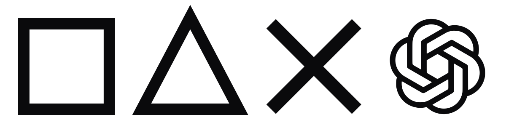
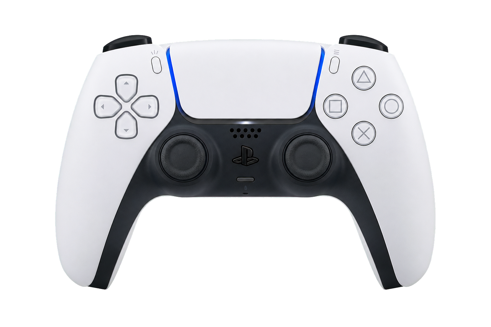

# ControlDeck

<p align="center">
  
</p>

<p align="center">
  <strong>Turn the controller already on your desk into a tactile command deck for Codex and macOS.</strong>
</p>

<p align="center">
  Speak prompts, move between tasks, review changes, control the pointer and
  feel your agent's state through lights and haptics—without breaking your flow.
</p>

<p align="center">
  
  
  
  
</p>

<p align="center">
  <a href="https://github.com/ihansel/control-deck/archive/refs/heads/main.zip"><strong>Download the source</strong></a>
  · <a href="#build-it-yourself">Build it yourself</a>
  · <a href="#meet-your-new-coding-loop">Explore the controls</a>
  · <a href="Docs/BluetoothMicrophone.md">Bluetooth microphone</a>
</p>

<p align="center">
  
</p>

## OpenAI Build Week 2026

> [!IMPORTANT]
> **Competition checkpoint:** [`4ac19949c2fc6257720a4b4286e7f46bfd1bae8e`](https://github.com/ihansel/control-deck/tree/4ac19949c2fc6257720a4b4286e7f46bfd1bae8e)
>
> I have been having too much fun to stop, so ControlDeck has continued to
> evolve since the Build Week submission. For competition evaluation, please
> use only the app and repository as they existed at the checkpoint above.
> The download on [control-deck.com](https://www.control-deck.com) intentionally
> tracks the latest release for current users, live demonstrations and talks.

ControlDeck is a native macOS app that makes a compatible game controller feel
like a purpose-built interface for Codex. Buttons become agent actions, sticks
become pointer and navigation controls, the touchpad scrolls, and the controller
responds to your work with light, haptics, adaptive triggers and optional sound.

It is useful beyond Codex, too. ControlDeck automatically switches layouts as
you move between apps, giving Finder, browsers, meetings, presentations,
creative tools, media apps, terminals and code editors controls that make sense
in their own context.

> [!NOTE]
> ControlDeck is an independent open-source project built with Codex and
> GPT-5.6. It is not affiliated with or endorsed by OpenAI or Sony Interactive
> Entertainment.

## Why you might love it

| Stay in flow | Use the whole controller | Make it yours |
| --- | --- | --- |
| Create tasks, dictate prompts, stop runs, review changes and jump between work without hunting for shortcuts. | Use analogue pointer control, smooth scrolling, touch gestures, click-and-drag, screenshots and tactile feedback. | Remap every input, tune acceleration and dead zones, configure an eight-app profile wheel and let profiles follow the foreground app. |

### A few favourite details

- **Tap or hold L2 to talk anywhere.** Focus any text field, then tap for
  hands-free capture or hold it like a walkie-talkie and release when done.
- **The controller reflects Codex state.** Light and haptics make thinking,
  completion and attention states feel immediate.
- **Options is a profile wheel.** Hold it, point the left stick toward one of
  eight app profiles, then release to switch without crowding everyday controls.
- **The pointer can replace a mouse.** Move across multiple displays, scroll in
  two axes, drag windows, highlight text and right-click.
- **Profiles follow your work.** Move from Codex to Terminal, a meeting or a
  creative app and ControlDeck changes with you.
- **Motion is useful only when you want it.** A hard shake can safely clear a
  text field after confirmation; every other gyro gesture is opt-in.

## Meet your new coding loop

The supplied Codex profile is designed around a simple physical vocabulary:

| What you want to do | Controller action |
| --- | --- |
| Point, click and drag | Left stick + Cross |
| Scroll vertically or horizontally | Right stick or touchpad |
| Dictate into the focused text field | Tap or hold L2 |
| Send / stop / review / plan | D-pad Up / Circle / Square / Triangle |
| Move between tasks | L1 / R1 |
| Start a new task | Create |
| Capture a selected area | Hold R2 and move the left stick |
| Copy / paste | L3 / R3 |
| Focus Codex | PS button |
| Show the current profile and mappings | Touchpad click |
| Toggle hands-free dictation | Microphone button |
| Switch applications | Hold PS; L1/R1 or D-pad to move; release PS to select; Circle cancels |

Hold **Options** for the profile wheel. Point the **left stick** toward one of
eight app logos, then release Options to switch. The defaults are Codex, Chrome,
Claude, Spotify, General macOS, Finder, Terminal and Slack; every slot can be
swapped in ControlDeck. Hold **Create + right stick** to step reasoning smarter
or faster.

Everything can be changed in the mapping editor and is saved immediately.

### Screen capture editor

Hold the mapped screen-capture trigger (R2 in the default Codex profile), move
the left stick to select an area, then release. ControlDeck copies the original
image to the clipboard and immediately opens a focused annotation editor. The
editor provides highlighter, pen, arrow, rectangle, text and redact tools plus
undo, redo, PNG save and edited-image copy.

The controller remains fully usable inside the editor: left stick moves the
pointer, Cross draws, L1/R1 changes tools, Square/Triangle undo and redo,
Touchpad click copies, Create saves, **Options chooses Done & Copy**, and Circle
dismisses the editor while leaving the original capture on the clipboard. The
editor labels the Done action explicitly and confirms that the current image
and all markup will replace the clipboard, ready to paste. Open **Screen
Capture** in ControlDeck to change clipboard behavior, editor presentation,
default tool, colour and line size.

### Gyro controls

Open **Gyro** to view live tilt and shake input, tune per-profile thresholds,
and map hard shake, four held tilts, or clockwise and counter-clockwise twists.
Only **hard shake → delete text with confirmation** is assigned by default.
The shake recognizer requires three strong alternating impulses and then shows
a native warning before clearing anything. It only operates on a focused,
editable text field; cancelling leaves the text untouched.

The optional suggested set maps tilts to navigation and window actions and
twists to previous/next tabs. These remain opt-in. **Tilt Run** is a timed 3D
rolling-ball game with seeded procedural courses, moving obstacles, time
tokens, checkpoints and a finish gate. It pauses normal gyro actions only
while a run is active.

## The undocumented Bluetooth microphone

One of the most interesting parts of ControlDeck started with a missing device:
macOS recognized the Bluetooth DualSense as a controller, but did not expose its
built-in microphone as a normal audio input.

**Codex found the undocumented wireless audio path—and built the bridge.**

```text
DualSense microphone → wireless audio → decode and buffer
                     → macOS input “DualSense Microphone” → Codex
```

ControlDeck publishes the result as a stable, selectable 48 kHz microphone. It
works with Codex's normal capture and transcription, does not permanently
replace the Mac's default microphone, and carefully separates audio packets
from controller input so speech cannot become phantom button presses.

USB uses the controller's physical audio device. Bluetooth uses the userspace
bridge and requires no administrator installation or custom audio driver.

[Read how the Bluetooth microphone works →](Docs/BluetoothMicrophone.md)

## App-aware profiles

ControlDeck includes sixteen curated profile groups covering Codex, Claude,
everyday macOS navigation, communication, presentations, creative work, media,
terminals and development tools.

<details>
<summary><strong>See the included app coverage</strong></summary>

- Codex and Claude
- Finder and general macOS navigation
- Safari, Chrome and other browsers
- Zoom, Microsoft Teams and Google Meet
- Keynote, PowerPoint and Google Slides
- Slack and Mail
- Photos, Spotify and media apps
- Figma
- Final Cut Pro, Premiere Pro and DaVinci Resolve
- Logic Pro
- Terminal, iTerm, Warp and Ghostty
- Xcode and common code editors

Native apps are matched by bundle identifier. Browser-hosted tools such as
Google Meet, Slides and Figma can also switch from the active window title.

</details>

Claude follows the same pointer-first vocabulary as Codex wherever equivalent
actions exist. The Terminal profile keeps consequential commands deliberate:
navigation, history, tabs, search, copy/paste, dictation and screenshots are
easy to reach, while interrupt and split-pane operations remain optional
remappings.

### Import and share profiles

Select a layout in **Profiles**, then choose **Export** to create a readable,
versioned `.controldeck-profile.json` file containing its button mappings,
pointer and scrolling behavior, touch gestures, gyro controls and app matching.
Anyone with ControlDeck can choose **Import Profile**, review the contents,
select a destination and confirm before any existing layout is replaced.

Imports keep the receiving Mac's app assignments by default. Importing app and
window matching is a separate opt-in choice in the review screen. The JSON
format is limited to 256 KB and has no executable fields. ControlDeck rejects
unknown schema keys, controller inputs, actions, gesture names, profile
versions and out-of-range numeric settings; it never runs content from a
profile file.

## Supported controllers

**DualSense provides the complete experience:** buttons, sticks, touchpad,
battery state, light bar, haptics, adaptive triggers, microphone, microphone
LED and app-generated speaker cues.

DualShock 4, Switch Pro, Switch 2 Pro, 8BitDo and compatible extended gamepads
also work through normalized buttons, sticks, app profiles and any haptics the
controller exposes. Hardware-specific features simply stay unavailable rather
than breaking the rest of the profile.

## Build it yourself

### What you need

- macOS 14.2 or later
- Swift 6.2 or newer through Xcode or the Xcode Command Line Tools
- A compatible controller connected by USB or Bluetooth
- The Codex desktop app for Codex-specific actions and task feedback
- An internet connection for the first build to download the pinned official
  Opus audio-codec source archive

### Build in three commands

```bash
git clone https://github.com/ihansel/control-deck.git
cd control-deck
./scripts/build-app.sh
```

The finished app is written to `dist/ControlDeck.app`. Open it with:

```bash
open dist/ControlDeck.app
```

For the everyday development loop, build and launch in one command:

```bash
./script/build_and_run.sh
```

The local bundle is ad-hoc signed for development on the Mac that built it.
Public downloads must use Developer ID signing and Apple notarization; the
release process deliberately fails closed instead of asking users to bypass
Gatekeeper. The published DMG and repository ZIP are universal builds for both
Apple Silicon and Intel Macs. The DMG opens as a branded drag-to-Applications
installer. See [the distribution guide](Docs/Distribution.md).

## First-time setup

1. Drag ControlDeck into Applications and open it.
2. Follow the automatic, skippable first-run guide. It shows exactly where the
   DualSense Create and PS buttons are, offers one-click access to Bluetooth
   Settings, and explains the USB option.
3. Grant Accessibility permission when the guide opens the correct macOS pane.
4. Continue through the everyday controls, profiles and optional advanced
   features, or skip and replay the guide later from **Setup**.
5. Run the safe hardware self-test when you are ready: one gentle haptic and
   one short tone.

The guide introduces pairing, permissions, pointer and scrolling, dictation,
screen capture and the eight-profile wheel. Its advanced page links directly
to Button Mapping, Touchpad, Pointer, Screen Capture, Shift Layer, Profiles,
Gyro and Customize with Codex so new users can start simply without losing
access to deeper tools.

To pair a DualSense wirelessly, disconnect USB and hold **Create + PS** until
the light bar flashes rapidly. Select **DualSense Wireless Controller** in
macOS Bluetooth settings.

For wireless controller dictation, prepare the microphone from **Setup**, then
choose **DualSense Microphone** once in Codex Settings → General.

## Customize it by talking to Codex

ControlDeck ships with a `control-deck-customizer` skill and a deliberately
narrow local MCP server. Open **Customize with Codex**, install the readable
local workspace and describe the change you want:

> “Make R3 open Quick Chat in Codex, and put Xcode in slot 4 of my profile
> wheel.”

The customization server can only read and update ControlDeck profiles,
per-profile gyro settings and the eight profile-wheel slots. It exposes no
general shell, filesystem, network, permission or download tool.

## Privacy and safety

- No network requests are made by the running app.
- No privileged helper or login item is installed.
- Gatekeeper is never disabled and quarantine attributes are never removed.
- Accessibility is used only for controller-driven pointer, keyboard and
  semantic interface actions.
- Recent Codex task identifiers, titles, latest user-message previews,
  timestamps and terminal states are read locally for feedback. Message
  previews are held only in memory; prompts and responses are not stored.
- The wireless microphone bridge taps only its own private muted audio source,
  not other apps or the system mix.

## Development and verification

Run the framework-free logic, protocol and security checks:

```bash
./scripts/test.sh
```

Run a full debug build:

```bash
swift build -c debug
```

The suite covers default mappings, profile-wheel selection, touch and gyro gesture
classification, pointer behaviour, task-state inference, profile persistence,
Bluetooth audio framing and the customization security boundary.

### Project structure

- `Sources/ControlDeck`: SwiftUI application, controller engine and resources
- `Tests/ControlDeckTests`: framework-free logic and protocol checks
- `Docs`: Bluetooth microphone and safe-distribution documentation
- `.agents/skills/control-deck-customizer`: bundled customization skill
- `Drivers/DualSenseMicrophone`: retained Core Audio driver prototype; not used
  by the normal application

## Frequently asked questions

<details>
<summary><strong>Do I need a DualSense?</strong></summary>

No. DualSense has the richest hardware integration, but compatible extended
controllers still get normalized input, pointer control, remapping and app
profiles.

</details>

<details>
<summary><strong>Does the Bluetooth controller microphone really work?</strong></summary>

Yes. ControlDeck decodes the controller's undocumented wireless audio stream
and publishes it as a normal macOS input named **DualSense Microphone**. It
requires macOS 14.2 or later.

</details>

<details>
<summary><strong>Does ControlDeck send my work anywhere?</strong></summary>

No. The running app makes no network requests. Codex task metadata used for
local feedback remains on the Mac, and prompts and responses are not stored by
ControlDeck.

</details>

<details>
<summary><strong>Can I change every mapping?</strong></summary>

Yes. Use the visual mapping editor, or ask Codex to update a profile through
the bundled constrained customization workspace.

</details>

## Licence and credits

ControlDeck is available under the [MIT License](LICENSE). Opus, Three.js and
Apple sample-derived components retain their notices alongside the bundled
resources and in `Drivers/DualSenseMicrophone`.

Built by [@ihansel](https://x.com/ihansel) with Codex and a real controller on
the desk.
